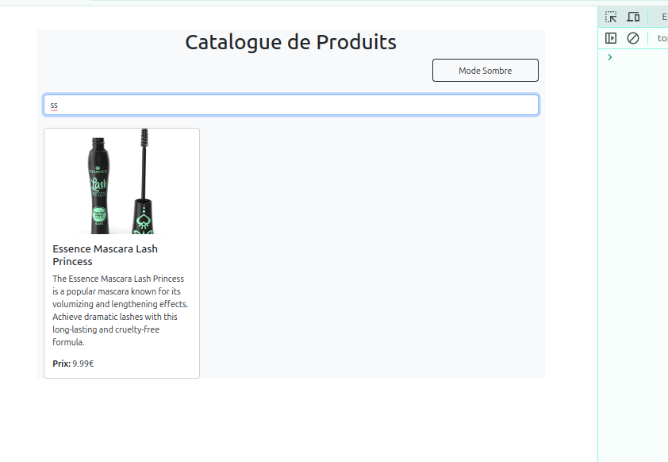

# TP React Hooks - Application de Gestion de Produits

Ce TP a pour objectif de mettre en pratique l'utilisation des Hooks React (useState, useEffect, useContext) ainsi que la création de Hooks personnalisés.

## Installation et configuration initiale

1. Cloner le dépôt :
```bash
git clone https://github.com/pr-daaif/tp-react-hooks.git
cd tp-react-hooks
```

2. Créer votre propre dépôt sur Github et changer le remote :
```bash
# Supprimer le remote origine
git remote remove origin

# Ajouter votre nouveau remote
git remote add origin https://github.com/[votre-username]/tp-react-hooks.git

# Premier push
git push -u origin main
```

3. Installer les dépendances :
```bash
npm install
```

4. Lancer l'application :
```bash
npm start
```

## Instructions pour le TP

Pour chaque exercice :
1. Lisez attentivement l'énoncé
2. Implémentez la solution
3. Testez votre implémentation (pensez à faire des copies d'écran)
4. Mettez à jour la section correspondante dans ce README avec :
   - Une brève explication de votre solution
   - Des captures d'écran montrant le fonctionnement
   - Les difficultés rencontrées et comment vous les avez résolues
5. Commitez vos changements avec un message descriptif

### Exercice 1 : État et Effets 
#### Objectif : Implémenter une recherche en temps réel

   - [ ] 1.1 Les modifications que j'ai apportées à la composante ProductSearch reposent sur l'utilisation de la technique du Lifting State Up. Cette technique consiste à déplacer l'état du searchTerm (terme de recherche) du composant enfant ProductSearch vers le composant parent App. Cela me permet de partager le terme de recherche avec le composant qui affiche la liste, ici ProductList.

   Dans ProductList, j'ai passé le searchTerm en tant qu'argument, que j'ai renommé filteringTerm. Ce dernier est ensuite utilisé dans ProductList pour filtrer la liste des produits en fonction du terme de recherche saisi par l'utilisateur dans ProductSearch

- [ ] 1.2
   terme de recherche. La technique du debounce consiste à retarder la mise à jour du terme de recherche utilisé pour filtrer la liste des produits, afin d'éviter de trop nombreuses mises à jour inutiles pendant que l'utilisateur tape.
   Dans ce cas, l'état searchTerm est mis à jour à chaque fois que l'utilisateur saisit un caractère dans le champ de recherche. Un useEffect est utilisé pour gérer ce comportement : dès que l'utilisateur cesse de taper pendant un délai de 500ms, le terme de recherche est transféré dans l'état debouncedSearchTerm.

   

### Exercice 2 : Context et Internationalisation
#### Objectif : Gérer les préférences de langue

J'ai suivi un exemple similaire à celui des thèmes pour ajouter la gestion de la langue dans l'application. Pour cela, j'ai créé un contexte LanguageContext qui permet de partager la langue sélectionnée (par exemple, "Fr" pour français ou "En" pour anglais) à travers tous les composants de l'application.

   
   <hr />
   


### Exercice 3 : Hooks Personnalisés
#### Objectif : Créer des hooks réutilisables

J'ai implémenté un hook personnalisé useDebounce qui permet de retarder l'exécution d'une fonction jusqu'à ce qu'un certain délai (delay) se soit écoulé depuis la dernière modification de la valeur (value). Ce hook est utile pour optimiser les performances

### Exercice 4 : Gestion Asynchrone et Pagination
#### Objectif : Gérer le chargement et la pagination

J'ai implémenté la pagination en appelant l'API avec les paramètres skip et limit. Chaque page contient 10 produits, et naviguer vers une nouvelle page signifie sauter 10 * (numéro de la page - 1) produits. Par exemple :
    
    Page 1 : Sauter 0 produit (skip = 0), afficher les 10 premiers produits.

    Page 2 : Sauter 10 produits (skip = 10), afficher les 10 produits suivants.

    Page 3 : Sauter 20 produits (skip = 20), afficher les 10 produits suivants.

L'état currentPage suit le numéro de la page actuelle, et la valeur de skip est calculée dynamiquement comme 10 * (currentPage - 1). Lorsque l'utilisateur clique sur "Suivant" ou "Précédent", la valeur de currentPage est mise à jour, ce qui déclenche un nouvel appel API avec les nouvelles valeurs de skip et limit.